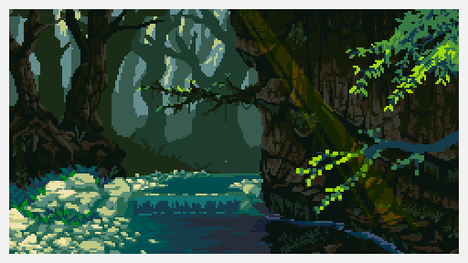

<h1> Maria Clara Daltro | Open to work!</h1>

  

  </a>

  

    Sou estudante de <b>Ciência da Computação</b>, com foco em <b>Desenvolvimento Web</b>. 
    Estou me especializando na integração entre o <b>Java</b> e a web moderna, dominando a base do frontend com 
    <b>HTML5, CSS3 e JavaScript</b>. Estudo frequentemente ferramentas como <b>Bootstrap</b> para criar interfaces 
    responsivas, além de técnicas e metodologias de <b>Programação Orientada a Objetos</b>.
  

  

    Participo ativamente do <b>desenvolvimento de aplicações práticas</b> como forma de aprimorar 
    minhas habilidades de codificação e desenvolver uma mentalidade alinhada às necessidades do mercado. 
    Além disso, busco me manter atualizado com as novas tendências da área, com o objetivo de me tornar 
    um profissional completo e preparado para os desafios do setor.
  

#

  <h3>GITHUB STATS</h3>

  

#

<h3>Desenvolver com "Meraki" é dar alma ao algoritmo e coração ao sistema.</h3>

  

  

    <h3>Connect with me!</h3>

 

</a>
    <h3>My Skills: </h3>
    

      
      
      
      
      
      
      
       
       
       
       
    

  

